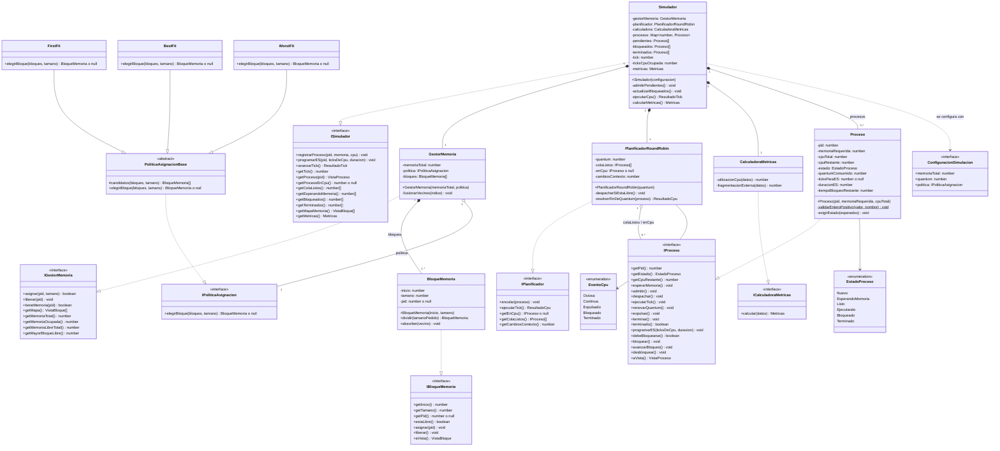

# Diagrama de clases

Versión editable (Mermaid, GitHub la dibuja):

```mermaid
classDiagram
direction TB

class EstadoProceso {
  <<enumeration>>
  Nuevo
  EsperandoMemoria
  Listo
  Ejecutando
  Bloqueado
  Terminado
}

class IProceso {
  <<interface>>
  +getPid() number
  +getEstado() EstadoProceso
  +getCpuRestante() number
  +esperarMemoria() void
  +admitir() void
  +despachar() void
  +ejecutarTick() void
  +renovarQuantum() void
  +expulsar() void
  +terminar() void
  +terminado() boolean
  +programarES(ticksDeCpu, duracion) void
  +debeBloquearse() boolean
  +bloquear() void
  +avanzarBloqueo() void
  +desbloquear() void
  +aVista() VistaProceso
}

class Proceso {
  -pid: number
  -memoriaRequerida: number
  -cpuTotal: number
  -cpuRestante: number
  -estado: EstadoProceso
  -quantumConsumido: number
  -ticksParaES: number o null
  -duracionES: number
  -tiempoBloqueoRestante: number
  +Proceso(pid, memoriaRequerida, cpuTotal)
  -validarEnteroPositivo(valor, nombre)$ void
  -exigirEstado(esperados) void
}

class IBloqueMemoria {
  <<interface>>
  +getInicio() number
  +getTamano() number
  +getPid() number o null
  +estaLibre() boolean
  +asignar(pid) void
  +liberar() void
  +aVista() VistaBloque
}

class BloqueMemoria {
  -inicio: number
  -tamano: number
  -pid: number o null
  +BloqueMemoria(inicio, tamano)
  +dividir(tamanoPedido) BloqueMemoria
  +absorber(vecino) void
}

class IPoliticaAsignacion {
  <<interface>>
  +elegirBloque(bloques, tamano) BloqueMemoria o null
}

class PoliticaAsignacionBase {
  <<abstract>>
  #candidatos(bloques, tamano) BloqueMemoria[]
  +elegirBloque(bloques, tamano)* BloqueMemoria o null
}

class FirstFit {
  +elegirBloque(bloques, tamano) BloqueMemoria o null
}
class BestFit {
  +elegirBloque(bloques, tamano) BloqueMemoria o null
}
class WorstFit {
  +elegirBloque(bloques, tamano) BloqueMemoria o null
}

class IGestorMemoria {
  <<interface>>
  +asignar(pid, tamano) boolean
  +liberar(pid) void
  +tieneMemoria(pid) boolean
  +getMapa() VistaBloque[]
  +getMemoriaTotal() number
  +getMemoriaOcupada() number
  +getMemoriaLibreTotal() number
  +getMayorBloqueLibre() number
}

class GestorMemoria {
  -memoriaTotal: number
  -politica: IPoliticaAsignacion
  -bloques: BloqueMemoria[]
  +GestorMemoria(memoriaTotal, politica)
  -fusionarVecinos(indice) void
}

class EventoCpu {
  <<enumeration>>
  Ociosa
  Continua
  Expulsado
  Bloqueado
  Terminado
}

class IPlanificador {
  <<interface>>
  +encolar(proceso) void
  +ejecutarTick() ResultadoCpu
  +getEnCpu() IProceso o null
  +getColaListos() IProceso[]
  +getCambiosContexto() number
}

class PlanificadorRoundRobin {
  -quantum: number
  -colaListos: IProceso[]
  -enCpu: IProceso o null
  -cambiosContexto: number
  +PlanificadorRoundRobin(quantum)
  -despacharSiEstaLibre() void
  -resolverFinDeQuantum(proceso) ResultadoCpu
}

class ICalculadoraMetricas {
  <<interface>>
  +calcular(datos) Metricas
}

class CalculadoraMetricas {
  -utilizacionCpu(datos) number
  -fragmentacionExterna(datos) number
}

class ISimulador {
  <<interface>>
  +registrarProceso(pid, memoria, cpu) void
  +programarES(pid, ticksDeCpu, duracion) void
  +avanzarTick() ResultadoTick
  +getTick() number
  +getProceso(pid) VistaProceso
  +getProcesoEnCpu() number o null
  +getColaListos() number[]
  +getEsperandoMemoria() number[]
  +getBloqueados() number[]
  +getTerminados() number[]
  +getMapaMemoria() VistaBloque[]
  +getMetricas() Metricas
}

class Simulador {
  -gestorMemoria: GestorMemoria
  -planificador: PlanificadorRoundRobin
  -calculadora: CalculadoraMetricas
  -procesos: Map~number, Proceso~
  -pendientes: Proceso[]
  -bloqueados: Proceso[]
  -terminados: Proceso[]
  -tick: number
  -ticksCpuOcupada: number
  -metricas: Metricas
  +Simulador(configuracion)
  -admitirPendientes() void
  -actualizarBloqueados() void
  -ejecutarCpu() ResultadoTick
  -calcularMetricas() Metricas
}

class ConfiguracionSimulacion {
  <<interface>>
  +memoriaTotal: number
  +quantum: number
  +politica: IPoliticaAsignacion
}

Proceso ..|> IProceso
Proceso --> EstadoProceso
BloqueMemoria ..|> IBloqueMemoria
PoliticaAsignacionBase ..|> IPoliticaAsignacion
FirstFit --|> PoliticaAsignacionBase
BestFit --|> PoliticaAsignacionBase
WorstFit --|> PoliticaAsignacionBase
GestorMemoria ..|> IGestorMemoria
GestorMemoria "1" *-- "1..*" BloqueMemoria : bloques
GestorMemoria "1" o-- "1" IPoliticaAsignacion : politica
PlanificadorRoundRobin ..|> IPlanificador
PlanificadorRoundRobin "1" o-- "0..*" IProceso : colaListos / enCpu
PlanificadorRoundRobin --> EventoCpu
CalculadoraMetricas ..|> ICalculadoraMetricas
Simulador ..|> ISimulador
Simulador "1" *-- "1" GestorMemoria
Simulador "1" *-- "1" PlanificadorRoundRobin
Simulador "1" *-- "1" CalculadoraMetricas
Simulador "1" *-- "0..*" Proceso : procesos
Simulador ..> ConfiguracionSimulacion : se configura con
```
